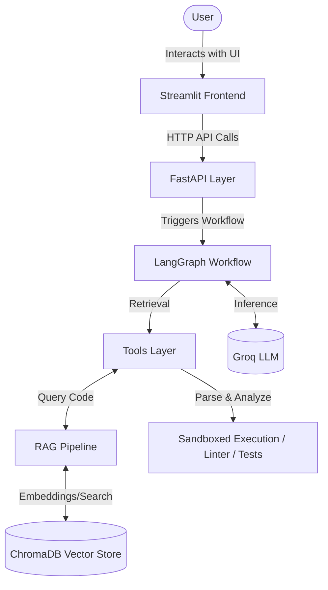

# Agentic Codebase Debugging Platform - Architecture

This document details the architecture for the Agentic Codebase Debugging Platform, breaking it down into distinct layers, highlighting their individual components, and detailing the security measures implemented.

## System Data Flow

## 1. RAG Pipeline (`backend/rag/`)

The Retrieval-Augmented Generation (RAG) pipeline is responsible for ingesting codebase files and enabling semantic search across the codebase.

*   **`repository_loader.py`**:
    *   Crawls the repository using `os.walk`.
    *   Implements a 10MB file size guard to prevent processing excessively large files.
    *   Prunes standard directories to ignore, such as `.git`, `.venv`, and `node_modules`.
    *   Utilizes `charset-normalizer` for robust encoding detection.
    *   Supported extensions: `.py`, `.js`, `.ts`, `.java`, `.cpp`, `.c`, `.h`, `.sql`, `.json`, `.yaml`, `.yml`, `.toml`, `.md`, `.txt`.
    *   Returns a `List[Document]` where each document contains metadata including `file_path`, `file_name`, and `file_extension`.
*   **`code_splitter.py`**:
    *   Uses `RecursiveCharacterTextSplitter` from `langchain_text_splitters`.
    *   Provides language-aware splitting logic tailored for Python, JS, TS, Java, C++, and Markdown.
    *   Splits code into 1500 character chunks with a 200 character overlap to preserve context.
    *   Includes a `_line_range_from_offset` utility function to calculate `start_line` and `end_line` from byte offsets.
    *   Enriches metadata with `repository_id` and the specific language of the chunk.
*   **`vector_store.py`**:
    *   Integrates with ChromaDB using HuggingFace `all-MiniLM-L6-v2` embeddings.
    *   Employs a single shared collection named `codebase_index`.
    *   Enforces mandatory `repository_id` filtering in the `search()` method to prevent cross-repository data leakage.
    *   Uses Chroma `$and` filter syntax for robustly combining the `repository_id` filter with any additional user-specified filters.

## 2. Tools Layer (`backend/tools/`)

The Tools Layer provides the LLM agent with capabilities to search code, inspect errors, check dependencies, lint code, and run tests.

*   **`code_search.py`**:
    *   Wraps `vector_store.search()`.
    *   Implements a lazy singleton pattern to prevent loading the embeddings model on import.
    *   Returns a formatted string detailing file paths and associated line ranges.
*   **`stack_trace.py`**:
    *   A regex-based Python traceback parser.
    *   Extracts critical information: error type, message, and the call stack structured with `file:line:function`.
    *   Identifies the suspected failure location to guide the debugging process.
*   **`dependency_inspector.py`**:
    *   Reads and parses standard dependency files: `requirements.txt`, `pyproject.toml`, `package.json`, etc.
    *   Leverages `charset-normalizer` for reading.
    *   Truncates output at 10,000 characters to prevent overflowing the LLM context window.
*   **`linter.py`**:
    *   `run_syntax_check`: Executes `python -m py_compile`.
    *   `run_linter`: Executes `ruff check`.
    *   Both functions are sandboxed via the `_resolve_safe_path` utility.
    *   Uses `sys.executable` to guarantee virtual environment safety during execution.
*   **`test_runner.py`**:
    *   `run_unit_tests`: Executes `pytest`.
    *   Imports and reuses the sandbox logic from `linter.py` to adhere to DRY principles.
    *   Ensures `pytest` runs from the repository root directory so that imports resolve correctly.
    *   Implements a strict 30-second execution timeout.

## Security Architecture

Robust security is fundamental, especially when executing arbitrary code or commands.

*   **Sandbox Root**: `REPOSITORY_STORAGE_ROOT` strictly defines the sandbox root directory.
*   **Repository ID Validation**: Uses the regex `^[A-Za-z0-9_-]+$` to validate `SAFE_REPOSITORY_ID`, effectively preventing path traversal attacks via manipulated repository IDs.
*   **Path Resolution (`_resolve_safe_path`)**:
    *   Explicitly rejects absolute paths.
    *   Uses `pathlib.relative_to()` to perform a symlink-safe containment check, ensuring paths stay within the designated repository.
    *   Restricts execution capabilities specifically to `.py` files.
*   **Subprocess Execution**:
    *   Always uses the list form for subprocess commands (ensuring `shell=False`).
    *   Relies on `sys.executable` to remain locked to the secure virtual environment.

## 3. LangGraph Workflow (`backend/graph/`) - *Planned*

The agent's decision-making and execution workflow will be managed by LangGraph.

*   **`state.py`**: Defines the `DebuggingState` as a `TypedDict`.
*   **`nodes.py`**: Implements individual functional nodes: `classify_error`, `retrieve_context`, `plan_debugging`, `generate_patch`, `validate_patch`, and `human_approval`.
*   **`workflow.py`**: Assembles the `StateGraph`, connecting nodes with conditional edges to support iterative retry loops.

## 4. API Layer (`backend/main.py`) - *Planned*

The backend will expose a FastAPI-based REST API.

*   `POST /api/v1/repositories/upload`: Endpoint to ingest a new repository.
*   `POST /api/v1/debug`: Endpoint to initiate a debugging session given an issue or stack trace.
*   `POST /api/v1/sessions/{session_id}/approve`: Endpoint to approve and apply a generated patch.

## 5. Frontend (`frontend/app.py`) - *Planned*

A Streamlit-based frontend will provide the user interface.

*   Features will include: repository upload forms, an interactive chat interface, a code diff viewer for proposed patches, and an approval mechanism to apply fixes.